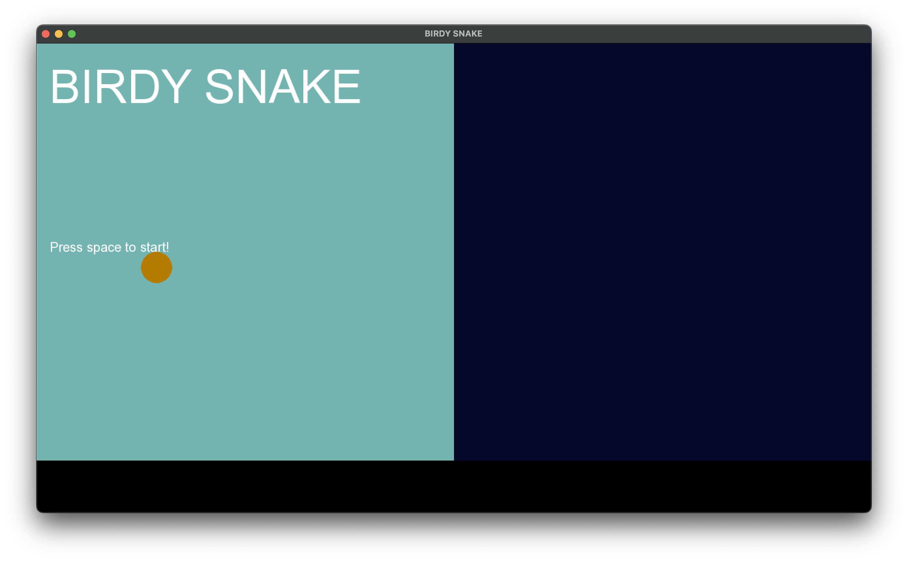

# Flappy-Snake
C++ Project for Laney College's CIS 25, Using SFML.<br>This repo is also available [on codeberg](https://codeberg.org/ryomams/Flappy-Snake).




It's flappy bird and snake and you play them at the same time 👍

## Running This Project
This project makes use of the [CMake template repo for SFML](https://github.com/SFML/cmake-sfml-project?tab=readme-ov-file), but I didn't use git when developing so there's no substantial commit history teehee<br> I'm not uploading my builds here, you'll have to do it yourself. To build and run this project:

1. Make sure CMake is installed on your system.
2. Download and unzip this repo, or clone it with a git client.
3. Using CMake from the command line, run
  ```
  cmake -B build
  cmake --build build
  ```
  and also make sure your working directory is the project you unzipped or cloned...<br>If you're on linux, [you'll need to install SFML's dependencies](https://github.com/SFML/cmake-sfml-project?tab=readme-ov-file#how-to-use).
  
4. CMake will have made its build in /build/bin of the uppermost folder...... enjoy!!

### Thanks to [SFML](https://www.sfml-dev.org) for existing and being an overall awesome project :)

## License
There is no license for this project. There is a [zlib license included with SFML](https://github.com/SFML/SFML/blob/master/license.md), but I'm not distributing SFML here.<br>Only your remorse can save you.
